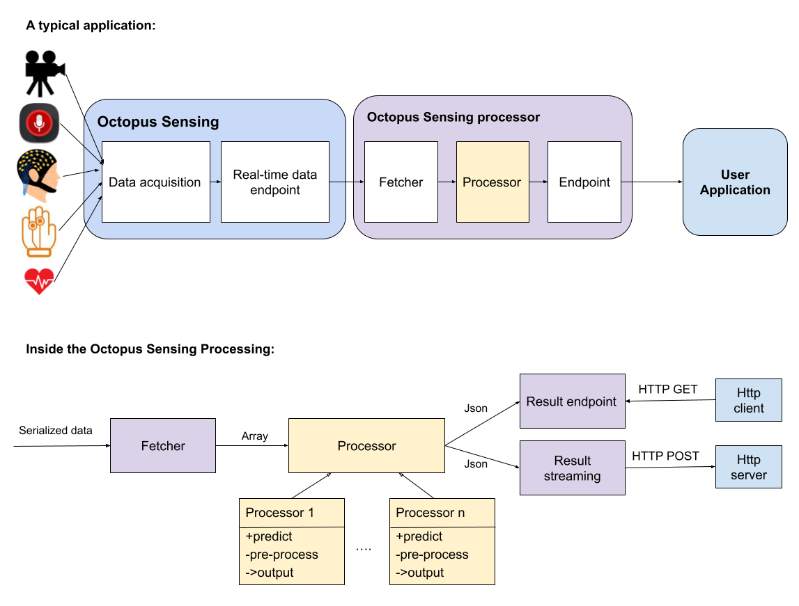

.. _octopus_sensing_processing:

******************************
Octopus Sensing Processing
******************************

Octopus Sensing Processing provides a framework for fetching data from `Octopus Sensing <https://octopus-sensing.nastaran-saffar.me/>`_ in real-time, processing it, and sending the result to another application. For example, reading physiological signals and detecting emotions in real-time.

User only writes *processing* part. e.g. a deep learning model. The framework handles the rest. In this way, for example, a user can have a few models and switch between them to compare how well they perform.

In the diagram above, the yellow boxes are the parts that you will write. The *fetcher* fetches the data from Octopus Sensing and passes it to your code. For each device, you will receive an array of data along with the device's metadata (e.g. framerate). The result of your code should be a Json object. The another application can read the result in two ways: 1. Querying the result from Octopus Sensing Processing when they need it, 2. receive a streaming of results whenever the result is available. The choice between the two depends on your application.

Installaion
==========

Tutorial
========
