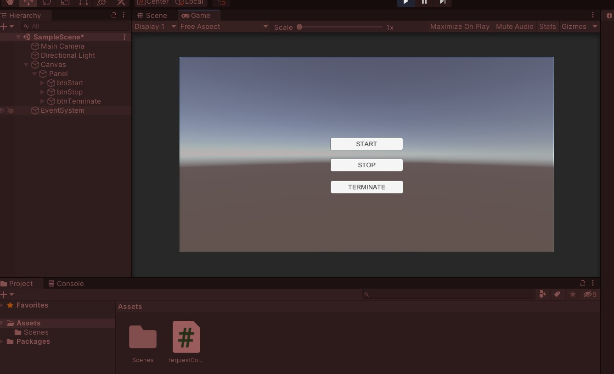

# Octupus Sensing - Unity Example
In this example, We're going to send predefined messages (START, STOP and, TERMINATE) from Unity to Octopus sensing, to control the recording of data. Octopus sensing (Python) is used as a server and Unity (C#) as a client.

Each button has the ability to send a specific message when pressed. See the UI below.

## References
- [HTTP Endpoint](https://octopus-sensing.nastaran-saffar.me/api/octopus_sensing.device_message_endpoint.html)
- [Predefined messages](https://octopus-sensing.nastaran-saffar.me/api/octopus_sensing.device_message_endpoint.html)